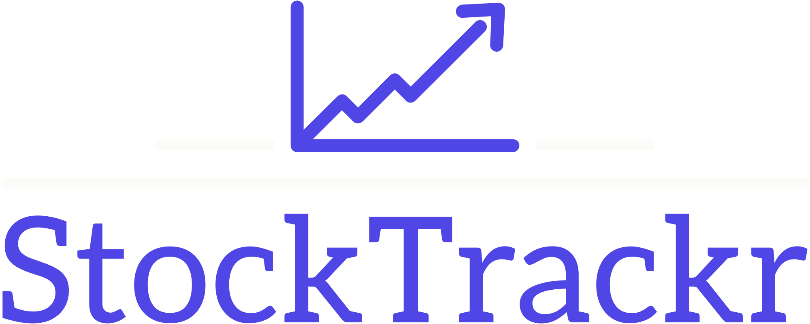

  

  <h2>Stock Portfolio Tracker</h2>

  

Stock Portfolio Tracker is a comprehensive web application designed to manage and analyze your stock investments. Built with ReactJS on the frontend and Java Spring Boot on the backend, the app offers real-time portfolio stats, historical purchase tracking, and options for buying and selling stocks. It integrates external APIs like Polygon.io for real-time stock prices and includes a robust email service for user registration.

## Table of contents

- [Key Features](#key-features)
- [Built with](#built-with)
<!-- - [Installation](#installation) -->

## Key Features

- User authentication via a secure login page to access the app's functionalities.
- Real-time stock price updates through the integration with Polygon.io, offering the most accurate and up-to-date market data.

- Email service integration for user registration, providing a smooth onboarding experience.

- A real-time graph that analyzes portfolio statistics, giving users insight into their investment performance.

- Comprehensive tracking of historical stock purchases, with filtering options to view specific transactions.

- Option to buy and sell stocks within the app, allowing users to manage their portfolios dynamically.

- A main portfolio page displaying current investments, portfolio value, and performance indicators.

- Historical data section for viewing bought and sold stocks, complete with detailed transaction history.

- User-friendly interface with sections for portfolio management, real-time analytics, and transaction history.

### Built with

- ReactJS
- React Query
- Styled Components
- Polygon.io API
- Java Spring Boot (Backend)
- PostgreSQL
